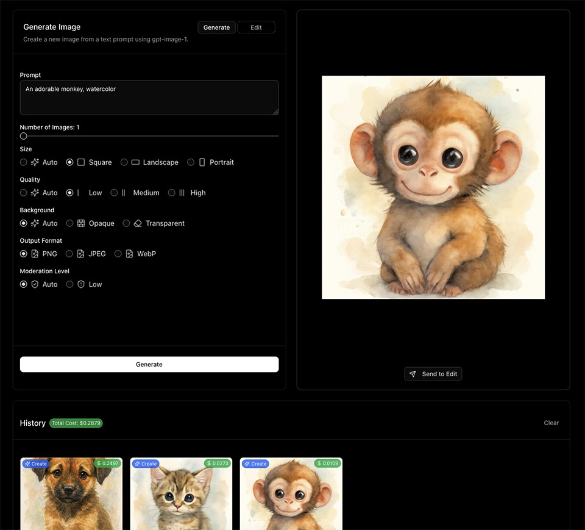

#  GPT-IMAGE-1 Playground

> A modern, feature-rich web application for generating and editing images using OpenAI's `gpt-image-1` model.

[](https://vercel.com/new/clone?repository-url=https://github.com/xAbdoAT/gpt-image-1-playground&env=OPENAI_API_KEY,NEXT_PUBLIC_IMAGE_STORAGE_MODE,APP_PASSWORD&envDescription=OpenAI%20API%20Key%20is%20required.%20Set%20storage%20mode%20to%20indexeddb%20for%20Vercel%20deployments.&project-name=gpt-image-playground&repository-name=gpt-image-playground)

<div align="center">
  
</div>

<div align="center">
  
  
  
  
  
  
</div>

---

## ✨ Features

### 🎨 **Image Generation**
- Create stunning images from text prompts
- Full control over image parameters (size, quality, format)
- Support for multiple output formats and compression options

<div align="center">
  
</div>

### 🖌️ **Image Editing**
- Modify existing images with text prompts
- Advanced masking tool for precise area selection
- Draw directly on images to create custom masks

<div align="center">
  
</div>

### 📊 **History & Analytics**
- Comprehensive generation history with detailed metadata
- Real-time cost tracking and usage analytics
- Export and manage your image collection

<div align="center">
  
</div>

### ⚙️ **Advanced Controls**
- Complete API parameter customization
- Background removal and modification options
- Quality and compression settings
- Moderation controls

### 💾 **Flexible Storage**
- **Filesystem Mode**: Save images to server directory
- **IndexedDB Mode**: Browser-based storage (perfect for serverless)
- Automatic storage mode detection for Vercel deployments

---

## 🚀 Quick Start

### Prerequisites
- [Node.js](https://nodejs.org/) (v20 or later)
- [npm](https://www.npmjs.com/), [yarn](https://yarnpkg.com/), [pnpm](https://pnpm.io/), or [bun](https://bun.sh/)
- OpenAI API key with `gpt-image-1` access

### 1. Clone & Install

Clone the repository:
```bash
git clone https://github.com/xAbdoAT/gpt-image-1-playground.git
```

Navigate to the project directory:
```bash
cd gpt-image-1-playground
```

Install dependencies:
```bash
npm install
```

### 2. Configure Environment
Create a `.env.local` file:
```dotenv
OPENAI_API_KEY=your_openai_api_key_here
# Optional: Custom API endpoint
# OPENAI_API_BASE_URL=your_custom_endpoint
# Optional: Password protection
# APP_PASSWORD=your_password
```

### 3. Start Development Server
```bash
npm run dev
```

### 4. Open Application
Visit [http://localhost:3000](http://localhost:3000) in your browser.

---

## 🛠️ Configuration

### Storage Modes

#### Filesystem Mode (Default)
Images are saved to `./generated-images` on the server.

#### IndexedDB Mode (Serverless)
Perfect for Vercel and other serverless platforms:
```dotenv
NEXT_PUBLIC_IMAGE_STORAGE_MODE=indexeddb
```

### Optional Features

#### Password Protection
```dotenv
APP_PASSWORD=your_secure_password
```

#### Custom API Endpoint
```dotenv
OPENAI_API_BASE_URL=https://your-custom-endpoint.com
```

---

## 🚀 Deployment

### Vercel (Recommended)
[](https://vercel.com/new/clone?repository-url=https://github.com/xAbdoAT/gpt-image-1-playground&env=OPENAI_API_KEY,NEXT_PUBLIC_IMAGE_STORAGE_MODE,APP_PASSWORD&envDescription=OpenAI%20API%20Key%20is%20required.%20Set%20storage%20mode%20to%20indexeddb%20for%20Vercel%20deployments.&project-name=gpt-image-playground&repository-name=gpt-image-playground)

**Required Environment Variables:**
- `OPENAI_API_KEY`: Your OpenAI API key
- `NEXT_PUBLIC_IMAGE_STORAGE_MODE`: Set to `indexeddb`

### Other Platforms
The application automatically detects deployment environment and adjusts storage mode accordingly.

---

## 📋 API Requirements

### OpenAI Organization Verification
⚠️ **Important**: Your OpenAI organization must be verified to use `gpt-image-1`. 
[Learn more about verification requirements](https://help.openai.com/en/articles/10910291-api-organization-verification)

### Model Limitations
- Masking feature may not provide 100% control
- Known limitations acknowledged by OpenAI
- Future updates expected to improve functionality

---

## 🛡️ Security

- API keys are stored securely in environment variables
- `.env.local` is automatically excluded from version control
- Password protection available for additional security
- No sensitive data is logged or exposed

---

## 🤝 Contributing

We welcome contributions! Please feel free to:

- 🐛 Report bugs and issues
- 💡 Suggest new features
- 📝 Improve documentation
- 🔧 Submit pull requests

---

## 📄 License

This project is licensed under the MIT License - see the [LICENSE](LICENSE) file for details.

---

<div align="center">
  <p>Built with ❤️ using Next.js, TypeScript, and OpenAI's GPT-IMAGE-1</p>
  
  <p>
    <a href="https://github.com/xAbdoAT/gpt-image-1-playground/stargazers">
      
    </a>
    <a href="https://github.com/xAbdoAT/gpt-image-1-playground/network">
      
    </a>
    <a href="https://github.com/xAbdoAT/gpt-image-1-playground/issues">
      
    </a>
  </p>
</div>
